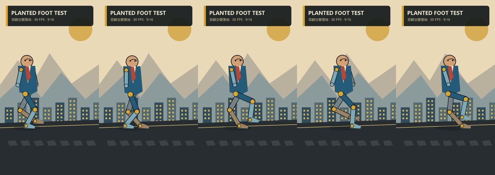

# Collage Video Studio

[](https://github.com/DingYi1024/collage-video-studio/actions/workflows/validate.yml)
[](https://github.com/DingYi1024/collage-video-studio/releases/latest)
[](LICENSE)

一个可恢复、可审计、可扩展的纸张拼贴视频制作 Skill。

它将创意意图、媒体任务、生成状态、技术 QA 和最终交付分开保存，可以从主题、人物/
产品照片或已有视频开始制作，并支持暂停、继续、局部重跑、检查点恢复和后端替换。

## 完整案例演示

仓库内置了一个可一键重建的 24 秒横屏案例：
**“马斯克成为首富的路径”**


- [查看完整实现流程与事实来源](examples/musk-wealth-demo/README.md)
- [观看 1920×1080 成品 MP4](examples/musk-wealth-demo/final.mp4)
- [观看 30 FPS 轻量预览 MP4](examples/musk-wealth-demo/result/preview.mp4)
- [查看 12 帧效果总览](examples/musk-wealth-demo/result/contact-sheet.jpg)
- [查看人物肩—肘关节五连帧](examples/musk-wealth-demo/result/rig-strip.jpg)
- [查看 0 错误、0 警告的 QA 报告](examples/musk-wealth-demo/qa/report.md)

案例覆盖事实核对、六镜故事、三风格比较、风格审批、JSONL 任务、57 个透明纸艺
图层、33 个有意义的活动层、六个定向主动作、五个父子跟随层（含两个层级关节）、
双轴落脚接触锁、逐帧连续性审计、预备/执行/回稳三段节奏、设计停顿、分段缓动、
30 FPS、2× 子像素合成、自然普通话男声、原创底乐、字幕、水印、最终渲染、
定向动态 QA 和创意审批。
无需 API 密钥即可重建：

```bash
python examples/musk-wealth-demo/build_demo.py
```

## 9:16 全身步态基准

新增一个可重建的竖屏技术案例，使用双关节逆运动学驱动左右大腿、小腿和脚：



- [观看 30 FPS 步态视频](examples/walk-cycle-demo/result/walk-cycle.mp4)
- [查看完整实现与运动审计](examples/walk-cycle-demo/README.md)

该案例包含 13 个图层、10 个活动层、8 个层级关节和 4 个交替落脚区间。根节点持续
前进时，落地脚同时锁定 x/y；滑步、重复同一只脚、双脚长时间同时着地或无有效位移
都会被验证器拒绝。

## 主要能力

- 丝滑优先的关键帧人物运动；默认不要求骨骼或真实步态
- 默认整片连续生成旁白，并独立检测人声内部、首尾和跨片段静音
- 多语言自动选声、四种节奏档案、缩写/小数保护及无标点长句安全分句
- 标点驱动四级气口，并拦截停顿位置错误、语义停顿不足和超过5.5秒的一口气朗读
- 逐短语时间清单驱动 QA 与同步字幕；旧项目自动回退为整段字幕
- 主题、照片、已有视频三种输入模式
- 故事与视觉方向双审批门
- 图片生成、图片编辑、图生视频、视频重绘、配音、音乐六类媒体任务
- 可编辑 `layers.json`、透明 PNG 图层和确定性多层合成
- 主动作、物理原因、运动密度、三段节奏和设计停顿的导演协议
- 父子图层跟随、从属动作说明、落地接触锁和逐帧运动突变检测
- 连续关键帧停顿审计、小状态精灵、可选层级关节与真实步态、铰链支点、曲线路径和
  大姿态闪现拦截
- 自动横竖画幅决策，并保存可审计的选择原因
- 分段缓动、连续速度曲线、子像素抗抖和多镜头动态转场
- 按时间线导演、前置密度检查并响度归一的多语言神经旁白
- JSONL 任务清单和可插拔后端
- 断点恢复、防重复付费提交和不确定提交保护
- FFmpeg 渲染、FFprobe 技术 QA、人工创意验收
- 检查点、状态报告和项目归档
- 使用视频内容哈希保存可跨复制、安装和解压保持有效的创意 QA 审批
- 离线端到端自测及可安装 `.skill` 打包
- 种子化纸纹与确定性图层生成，减少维护更新中的无意义二进制变化

## 安装

推荐使用开放的 Skills CLI 从 GitHub 安装：

```bash
npx skills add DingYi1024/collage-video-studio
```

全局安装到 Codex：

```bash
npx skills add DingYi1024/collage-video-studio \
  --skill collage-video-studio \
  --global \
  --agent codex
```

检查仓库中可安装的 Skill：

```bash
npx skills add DingYi1024/collage-video-studio --list
```

更新已安装版本：

```bash
npx skills update collage-video-studio -g -y
```

也可以从
[GitHub Releases](https://github.com/DingYi1024/collage-video-studio/releases/latest)
下载最新的 `collage-video-studio.skill`，通过支持 `.skill` 文件的客户端安装。

如果直接使用源码，请确保系统中已有：

- Python 3.11 或更高版本
- FFmpeg
- FFprobe

真实媒体生成还需要安装后端 SDK：

```bash
python -m pip install -r requirements.txt
```

API 密钥只通过环境变量提供，不要写入项目文件。

## 快速开始

```bash
python scripts/studio.py doctor
python scripts/studio.py init ./my-project \
  --mode topic \
  --topic "为什么城市会越来越热" \
  --duration 30 \
  --aspect auto \
  --language zh
```

然后按照 [SKILL.md](SKILL.md) 中的审批门和制作流程执行。

真实媒体接入见
[references/replicate-backend.md](references/replicate-backend.md)。首次付费运行建议：

```bash
python scripts/replicate_backend.py doctor ./my-project
python scripts/job_runner.py ./my-project --stage images \
  --adapter scripts/replicate_backend.py --limit 1 --retries 0
```

## 开发与验证

修改 Skill、任务协议或后端后运行：

```bash
python scripts/selftest.py
python scripts/package_skill.py --output dist/collage-video-studio.skill --force
```

自测不会调用付费媒体服务。它会验证六类生产路由、重复提交保护、分层清单、独立图层
合成、完整项目流程、渲染、QA、审批、恢复、报告和打包。

## 版本与发布

- 版本号保存在 [VERSION](VERSION)。
- 每次可见变更写入 [CHANGELOG.md](CHANGELOG.md)。
- 使用语义化版本：`主版本.次版本.修订版本`。
- 推送 `v*` Tag 后，GitHub Actions 会重新自测、打包并创建 Release。

## 目录

```text
agents/       Agent 客户端入口配置
assets/       后端模板
examples/     可重建的完整案例、真实素材和最终效果
references/   按需读取的规范和操作文档
scripts/      项目控制、执行、渲染、QA、测试和打包工具
SKILL.md      Skill 主入口
```

## 安全

- 不提交 API 密钥、用户原始素材或生产项目目录；仓库只保留明确用于公开演示的案例媒体。
- 不在服务端状态未知时直接重新提交付费任务。
- 处理人脸、客户素材或未发布产品前，确认所选模型的数据政策。

安全问题与凭据泄漏处理见 [SECURITY.md](SECURITY.md)。

## 许可

本项目使用 [MIT License](LICENSE)。
