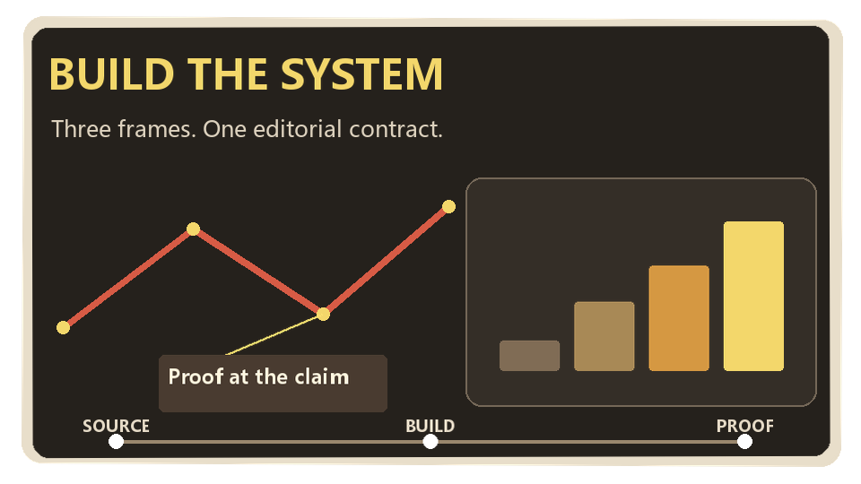
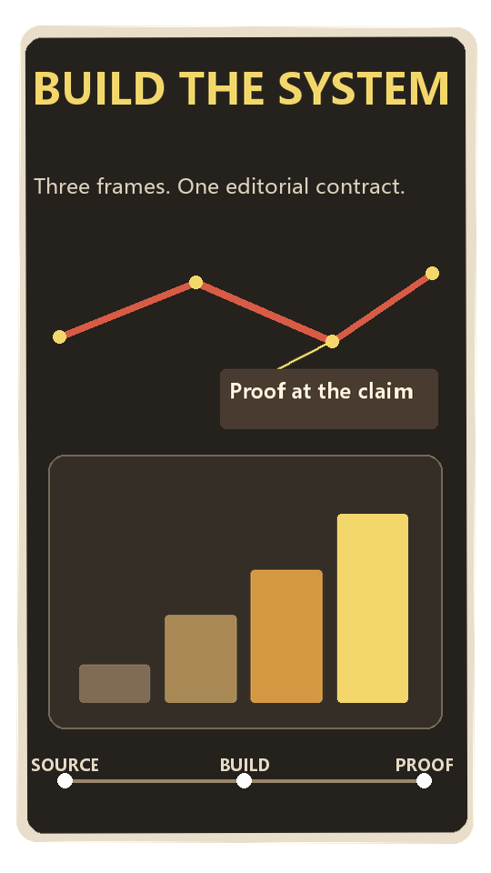
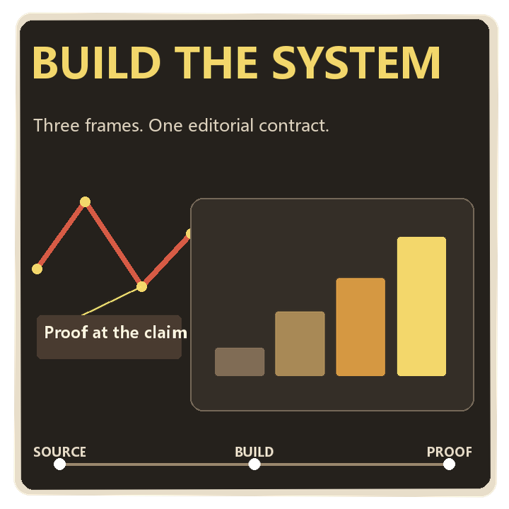

# Collage Video Studio

[](https://github.com/DingYi1024/collage-video-studio/actions/workflows/validate.yml)
[](https://github.com/DingYi1024/collage-video-studio/releases/latest)
[](LICENSE)

一个可恢复、可审计、可扩展的纸张拼贴视频制作 Skill。

它将创意意图、媒体任务、生成状态、技术 QA 和最终交付分开保存，可以从主题、人物/
产品照片或已有视频开始制作，并支持暂停、继续、局部重跑、检查点恢复和后端替换。

## v6 作品集级正式生产

v6 不再把“有 Remotion 工作区”和“最终用 Remotion 渲染”混为一谈。正式成片由一个
项目自有的 `ProductionFilm` composition 直接消费所有 `layers:*` 图层包；逐镜头
预烘焙 MP4 不再是作品集模式的视觉输入。

新增硬门禁包括：真实生产素材来源、Codex 内置生成工具调用账本、整片构图/环境/
景别/主体重复度审计、三画幅 director plan、逐镜头 composition proof、3–5 秒
同运行时 action proof、嵌套图层文件哈希、实测旁白定帧并同步缩放图层时钟，以及
Remotion 成片指纹。详见
[Portfolio Production Standard v6](references/production-standard-v6.md)。

```bash
python scripts/creative_quality.py <project-dir>
python scripts/proof_system.py <project-dir> --register composition --all
python scripts/action_proof.py create <project-dir> <registered-layers.json>
python scripts/readiness_seal.py seal <project-dir> --subtitles <timing.json> \
  --note "<review note>"
python scripts/render.py <project-dir> --output final.mp4
```

## v5 完整生产协议与可视化执行

仓库现在包含真实的 Remotion/React 可视化工作区，而不是只靠文档描述编辑协议：

```bash
cd workspace
npm ci
npm run dev
```

工作区支持 Remotion Player 播放/拖动时间线、递归图层选择、属性检查器、JSON
打开/保存、统一 edit point/proof moment 跳转、状态序列、持续显隐、瞬时强调、循环
世界、种子母题和视听事件，以及同一故事在 16:9、9:16、1:1 间切换导演方案。
`npm run render` 会通过 Remotion CLI 生成真实 MP4。

v5 不再把这些能力当成互不相干的工具。新项目会被同一条可恢复生产链约束：

```text
风格卡/画幅/视差选择 → 三方案比较 → 精确预算审批 → 节奏分镜
→ 完整素材族/持续世界 → 供应商账本 → 实测旁白定帧
→ 构图/世界/字幕证明 → readiness seal → 三画幅执行 → QA → 本地交付
```

详见 [Production Protocol v5](references/production-protocol-v5.md)。`project_ops.py next`
会逐步返回下一条可执行命令，缺失或过期的方案、分镜、证明与运行时指纹不会被跳过。

同一个递归多层构图现在可以分别导演横屏、竖屏和方屏，而不是裁切一张平面图：

| 16:9 | 9:16 | 1:1 |
|---|---|---|
|  |  |  |

- [观看 16:9 成片](examples/editorial-proof-demo/result/proof-16x9.mp4)
- [观看 9:16 成片](examples/editorial-proof-demo/result/proof-9x16.mp4)
- [观看 1:1 成片](examples/editorial-proof-demo/result/proof-1x1.mp4)
- [查看三画幅构图与运动门报告](examples/editorial-proof-demo/result/proof-report.json)

持续世界专项证明同样包含三份独立导演成片：
[16:9](examples/world-motion-proof/world-16x9.mp4)、
[9:16](examples/world-motion-proof/world-9x16.mp4)、
[1:1](examples/world-motion-proof/world-1x1.mp4) 与
[接缝/覆盖/轨迹报告](examples/world-motion-proof/proof-report.json)。

三份视频均由同一份源构图编译，包含递归父子图层、相机耦合景深、可编辑文字、
data-SVG、图表、时间线、路线和自动避让标注；每份都是 11 层、11 个活动层、恒定
30 FPS。运行：

```bash
python examples/editorial-proof-demo/build_demo.py
```

## 完整案例演示

仓库内置了一个可重建的约 30 秒横屏案例：
**“马斯克成为首富的路径”**


- [查看完整实现流程与事实来源](examples/musk-wealth-demo/README.md)
- [观看 1920×1080 成品 MP4](examples/musk-wealth-demo/final.mp4)
- [观看 30 FPS 轻量预览 MP4](examples/musk-wealth-demo/result/preview.mp4)
- [查看 12 帧效果总览](examples/musk-wealth-demo/result/contact-sheet.jpg)
- [查看同运行时动作六连帧](examples/musk-wealth-demo/proofs/action/contact-sheet.jpg)
- [查看 0 错误、0 警告的 QA 报告](examples/musk-wealth-demo/qa/report.md)

案例使用 3 张原创生产源图，拆分为 4 套环境、4 个身份阶段和 8 个独立道具，组成
8 个镜头、8 种构图、4 个景别、rear/subject/front 纵深、数据驱动时间线/图表与
三画幅导演方案。连续普通话旁白经过句内长静音压缩，913 个实测帧直接重定时镜头
和图层关键帧；最终由单一 Remotion composition 输出 BT.709 limited-range 成片。

重建素材包（生成源图已经随案例保存）：

```bash
python examples/musk-wealth-demo/create_v6_demo.py
```

## 9:16 全身步态基准

新增一个可重建的竖屏技术案例，使用双关节逆运动学驱动左右大腿、小腿和脚：


- [观看 30 FPS 步态视频](examples/walk-cycle-demo/result/walk-cycle.mp4)
- [查看完整实现与运动审计](examples/walk-cycle-demo/README.md)

该案例包含 13 个图层、10 个活动层、8 个层级关节和 4 个交替落脚区间。根节点持续
前进时，落地脚同时锁定 x/y；滑步、重复同一只脚、双脚长时间同时着地或无有效位移
都会被验证器拒绝。

## 主要能力

- 固定三方案比较、制作深度下限、精确供应商调用/本地派生/避免调用核算
- 三张版本化风格卡、画幅和视差偏好的一次性 intake 决策
- 持续循环世界、远/中/地面/近景深度速度、世界/屏幕锚定和近景遮挡
- 源分辨率接缝、三画幅覆盖、镜头补偿位移、带符号轨迹与终点顺序证明
- identity-bound 状态表、逐状态朝向、锚点证据与锚点漂移阻断
- 完整源上下文蒙版修复，禁止独立生成单个替换成员
- `locked-static` 静态镜头保护，不用无意义动画填充档位指标
- 素材、音频、时序、字幕、构图、证明和运行时统一 readiness seal
- 编码后字幕与无字幕母版的逐 cue 像素对照证明
- surface/target/report/evidence/contact-sheet 绑定的质量审批生命周期
- 场景范围预览、渲染/供应商/本地派生/避免调用生产指标
- 每场三段以上节奏分镜、建立/动作/结论证明时刻及视听同源事件
- 完整 rear/subject/front 素材源包、三画幅揭示范围和主体独立移动范围
- provider-native 色键观测、源文件绑定策略指纹及失败素材 recovery-source
- composition/subtitle/audio/provider/protocol 分面运行时指纹和增量证明失效
- 有保护的预览导演修订与带授权范围的语义修订
- 源音频指纹绑定的旁白响度校准，以及仅音频改变时的视觉流复用条件
- 递归父子构图、显式编辑点和相机耦合的前/中/后景视差
- Remotion/React 可视化编辑工作区、Player 时间线和 CLI MP4 渲染
- 本地可编辑文字、形状、data-SVG、柱状图、时间线、路线与避让标注
- 同一构图分别导演 16:9、9:16、1:1，并验证安全区与文字适配
- 身份、拓扑、机制、信息图语义契约及其自动检查
- style、composition、moment 三类 proof 与证据指纹失效
- 基于实测人声的 beat/shot 整数帧重排，以及实际执行的语义转场路由
- 注册纵深栈及镜头耦合视差
- 观察实际边框颜色的色键清理、去溢色和透明/半透明边缘残留 QA
- 追加式供应商生命周期：预留、完成、失败、拒绝、恢复、替换、复用
- 可安装 Codex Plugin 与传统 `.skill` 双分发
- 丝滑优先的关键帧人物运动；默认不要求骨骼或真实步态
- 所有生产项目默认恒定 30 FPS，低帧率素材自动运动插帧，禁止用重复帧伪装流畅
- 全管线卡顿、片尾冻结、素材时长覆盖和声明式阅读停顿检查
- 默认整片连续生成旁白，并独立检测人声内部、首尾和跨片段静音
- 多语言自动选声、四种节奏档案、缩写/小数保护及无标点长句安全分句
- 标点驱动四级气口，并拦截停顿位置错误、语义停顿不足和超过5.5秒的一口气朗读
- 逐短语时间清单驱动 QA 与同步字幕；旧项目自动回退为整段字幕
- 第三方 TTS 可返回标准时间清单；缺失时会显式降级而非假装同步
- 分别检测纯人声与最终混音的 LUFS 和真峰值，过响、过轻、削波都阻断交付
- 主题、照片、已有视频三种输入模式
- 故事与视觉方向双审批门
- 图片生成、图片编辑、图生视频、视频重绘、配音、音乐六类媒体任务
- 可编辑 `layers.json`、透明 PNG 图层和确定性多层合成
- 注册画布素材族、离散姿态序列、持续显隐、无缝环境条带和固定种子母题场
- 草稿/均衡/全景深制作档位与精确的生成尝试预算
- 任务、素材和 QA 输入内容指纹；参数或素材变化会自动判定旧证据过期
- 独立动态密度审计，拦截“没有重复帧但仍然像静态图”的成片
- 主动作、物理原因、运动密度、三段节奏和设计停顿的导演协议
- 父子图层跟随、从属动作说明、落地接触锁和逐帧运动突变检测
- 连续关键帧停顿审计、小状态精灵、可选层级关节与真实步态、铰链支点、曲线路径和
  大姿态闪现拦截
- 自动横竖画幅决策，并保存可审计的选择原因
- 分段缓动、连续速度曲线、子像素抗抖和多镜头动态转场
- 按时间线导演、前置密度检查并响度归一的多语言神经旁白
- JSONL 任务清单和可插拔后端
- 断点恢复、防重复付费提交和不确定提交保护
- FFmpeg 渲染、FFprobe 技术 QA、人工创意验收
- 检查点、状态报告和项目归档
- 使用视频内容哈希保存可跨复制、安装和解压保持有效的创意 QA 审批
- 离线端到端自测及可安装 `.skill` 打包
- 种子化纸纹与确定性图层生成，减少维护更新中的无意义二进制变化

## 安装

推荐使用开放的 Skills CLI 从 GitHub 安装：

```bash
npx skills add DingYi1024/collage-video-studio
```

全局安装到 Codex：

```bash
npx skills add DingYi1024/collage-video-studio \
  --skill collage-video-studio \
  --global \
  --agent codex
```

检查仓库中可安装的 Skill：

```bash
npx skills add DingYi1024/collage-video-studio --list
```

更新已安装版本：

```bash
npx skills update collage-video-studio -g -y
```

也可以从
[GitHub Releases](https://github.com/DingYi1024/collage-video-studio/releases/latest)
下载最新的 `collage-video-studio.skill`，通过支持 `.skill` 文件的客户端安装。

如果直接使用源码，请确保系统中已有：

- Python 3.11 或更高版本
- Node.js 22 或更高版本（可视化工作区）
- FFmpeg
- FFprobe

真实媒体生成还需要安装后端 SDK：

```bash
python -m pip install -r requirements.txt
```

API 密钥只通过环境变量提供，不要写入项目文件。

## 快速开始

```bash
python scripts/studio.py doctor
python scripts/studio.py init ./my-project \
  --mode topic \
  --topic "为什么城市会越来越热" \
  --duration 30 \
  --aspect auto \
  --language zh
```

然后按照 [SKILL.md](SKILL.md) 中的审批门和制作流程执行。

真实媒体接入见
[references/replicate-backend.md](references/replicate-backend.md)。首次付费运行建议：

```bash
python scripts/replicate_backend.py doctor ./my-project
python scripts/job_runner.py ./my-project --stage images \
  --adapter scripts/replicate_backend.py --limit 1 --retries 0
```

## 开发与验证

修改 Skill、任务协议或后端后运行：

```bash
python scripts/selftest.py
cd workspace
npm ci
npm run build
npm run render
cd ..
python scripts/sync_plugin.py --check
python scripts/package_skill.py --output dist/collage-video-studio.skill --force
```

自测不会调用付费媒体服务。它会验证六类生产路由、重复提交保护、分层清单、独立图层
合成、三方案/节奏分镜/素材源包、观测色键/注册素材族、精确尝试账本、预览修订、
运行时分面失效、旁白校准、30 FPS 运动插帧、全局冻结检测、旁白时间清单、最终
响度、完整项目流程、渲染、QA、审批、恢复、报告和打包。

## 版本与发布

- 版本号保存在 [VERSION](VERSION)。
- 每次可见变更写入 [CHANGELOG.md](CHANGELOG.md)。
- 使用语义化版本：`主版本.次版本.修订版本`。
- 推送 `v*` Tag 后，GitHub Actions 会重新自测、打包并创建 Release。

## 目录

```text
agents/       Agent 客户端入口配置
assets/       后端模板
examples/     可重建的完整案例、真实素材和最终效果
references/   按需读取的规范和操作文档
scripts/      项目控制、执行、渲染、QA、测试和打包工具
workspace/    Remotion/React 可视化编辑与 CLI 渲染工作区
SKILL.md      Skill 主入口
```

## 安全

- 不提交 API 密钥、用户原始素材或生产项目目录；仓库只保留明确用于公开演示的案例媒体。
- 不在服务端状态未知时直接重新提交付费任务。
- 处理人脸、客户素材或未发布产品前，确认所选模型的数据政策。

安全问题与凭据泄漏处理见 [SECURITY.md](SECURITY.md)。

## 许可

本项目使用 [MIT License](LICENSE)。
