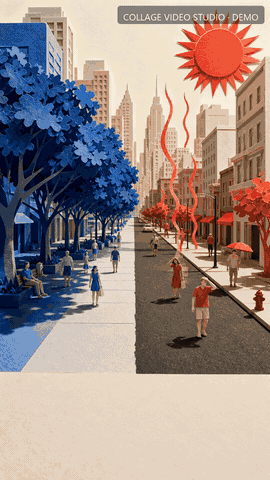
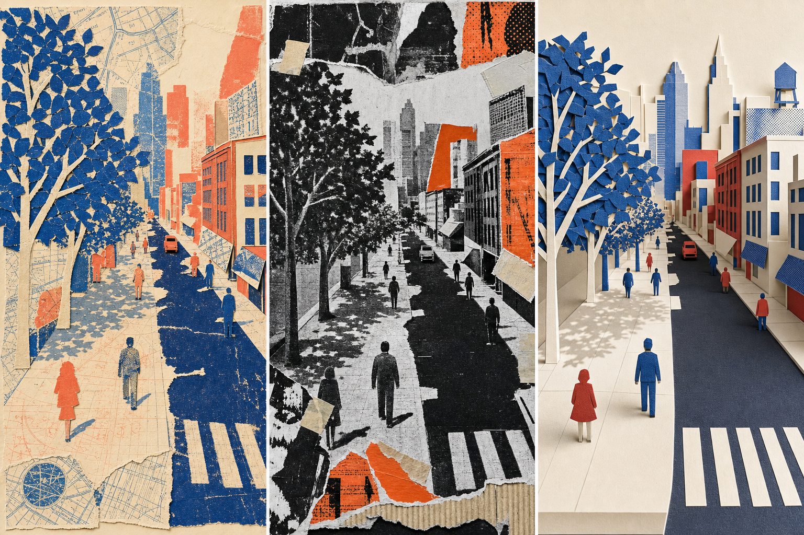

# 完整案例：同一座城市，为什么会有两个温度？

这个案例把 `collage-video-studio` 的完整生产链跑了一遍，不是静态样例，也没有使用测试占位图。



- 成品：[final.mp4](final.mp4)
- 八帧效果总览：[result/contact-sheet.jpg](result/contact-sheet.jpg)
- 技术质检：[qa/report.md](qa/report.md)
- 机器可读构建摘要：[result/build-summary.json](result/build-summary.json)

## 输入 Brief

> 用 16 秒解释城市热岛：为什么同一座城市里，树荫下与黑色路面的体感差很多？最后给出植树、浅色屋顶和凉爽公共空间三种可执行方案。竖屏、普通话、纸艺科普风。

约束：

- 9:16，24 fps，16 秒；
- 4 个叙事节拍，每个节拍 1 个 4 秒镜头；
- 画面内不让生成模型写字，所有准确文字由渲染阶段叠加；
- 三套风格必须用同一代表场景比较，批准后才能批量生产。

## 全流程是怎样实现的

### 1. 把 Brief 写成可验证项目

`project.seed.json` 保存创作意图，包含主题、时长、画幅、四个节拍、旁白、镜头动作、三套候选风格和声音混音。它不保存本地绝对路径或供应商临时链接。

四个节拍分别承担：

1. 钩子：同一条街出现两个温度世界；
2. 证据：树荫与沥青的同条件对照；
3. 原理：遮阴、蒸腾、白天蓄热和夜间释热；
4. 解法：连续树荫、浅色屋顶、公交道和水广场。

### 2. 先比较三套方向

同一个城市街道被制作成三套方向：



| 方向 | 特征 | 决策 |
|---|---|---|
| `map-print` | 地图线条、丝网套印、蓝橙双色 | 信息感强，但空间解释略扁 |
| `street-copy` | 黑白复印、酸性橙、撕纸胶带 | 冲击力强，但不适合平静科普 |
| `paper-lab` | 精确纸艺模型、米白/钴蓝/朱红 | **选中**：机制表达最清楚 |

三个预览由 `styles.jsonl` 定义、由任务执行器登记到 `state.json`。`choose-theme paper-lab` 之后，`approve --gate style` 把选择及内容指纹写入审批记录。

### 3. 把分镜变成可重放任务

`studio.py jobs` 分别生成五份 JSONL：

- `jobs/styles.jsonl`：三套方向；
- `jobs/images.jsonl`：四张最终关键帧；
- `jobs/motion.jsonl`：四段镜头运动；
- `jobs/voice.jsonl`：四段普通话旁白；
- `jobs/music.jsonl`：一条 16 秒底乐。

每行任务都有稳定 ID、提示词、输入、参数和预期输出。例如 `image:b03-s01` 永远对应“城市剖面机制”镜头，因此失败重跑不会把素材串错。

### 4. 真实素材如何进入统一后端接口

案例的关键帧由图像生成模型制作，并固定在 `source-media/`，避免读者为了重跑案例先配置付费密钥。`demo_backend.py` 实现与生产后端相同的 `execute(job, project_dir)` 契约：

- 风格与关键帧任务复制已批准的真实素材；
- 动效任务用 FFmpeg 对每张关键帧执行不同的缓慢推、横移、纵向揭示和拉远；
- 旁白任务读取固定普通话 WAV；
- 音乐任务读取固定的原创合成底乐；
- 每个成功文件由 `job_runner.py` 原子登记进 `state.json`。

换成 Replicate 或自己的 API 时，只替换 adapter，项目、提示词、任务清单、状态、渲染器和 QA 都不用改。

### 5. 合成与质检

`render.py` 做这些事：

1. 把四段动效统一成 1080×1920、24 fps；
2. 按时间线无缝拼接；
3. 用本地字体生成准确中文字幕和水印；
4. 对齐四段旁白；
5. 混入音乐，并用 sidechain compressor 在说话时自动压低音乐；
6. 输出 H.264/AAC、`yuv420p`、fast-start MP4。

`qa.py` 再检查时长、画布、像素格式、音视频流和全部登记素材，并抽取 8 帧供人工检查。最终 `creative-qa` 审批会绑定 QA 时间和最终文件签名；一旦成品被替换，审批自动失效。

## 一条命令重建

前置条件：Python 3.10+、Pillow、FFmpeg、FFprobe。

```bash
python examples/city-heat-demo/build_demo.py
```

脚本只会重建本案例目录中的 `project.json`、`state.json`、`jobs/`、`media/`、`render/`、`qa/`、`result/` 和 `final.mp4`，不会改动 `source-media/`。

构建完成后：

```bash
python scripts/studio.py status examples/city-heat-demo --verbose
```

应看到五个阶段全部完成、三个审批门均为 `valid`、`render: ready`。

## 如何基于这个案例继续改

- 改内容：复制 `project.seed.json`，替换 topic、beats 和 narration；
- 改视觉：保留三方向比较，调整 candidate themes 的六个字段；
- 换模型：复制 `assets/backend_adapter.py` 或配置 `scripts/replicate_backend.py`；
- 加镜头：给 beat 添加稳定 shot ID，重新生成 manifests；
- 改成真人/产品：使用 `photo` 模式并明确 `anchor_policy`；
- 增加检查：在 `qa.py` 外接品牌、字幕安全区或内容合规检测，但不要绕过已有审批指纹。

## 素材说明

三方向预览和四张关键帧为本仓库案例专用生成素材；普通话旁白由系统语音合成后固定为 WAV；底乐由本地音频合成器生成。所有运行时输出都能从已固定素材和 JSONL 清单重新构建。
