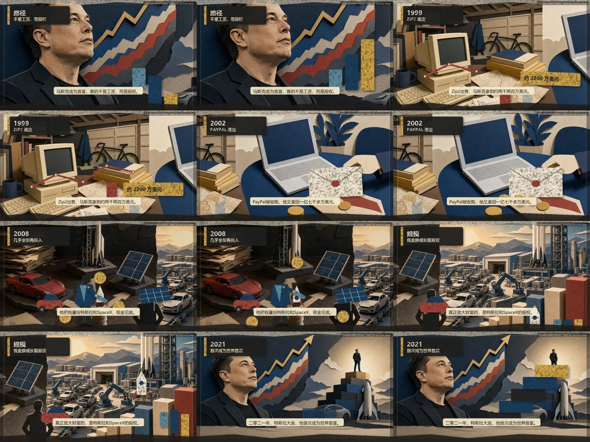
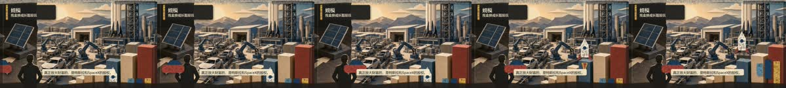
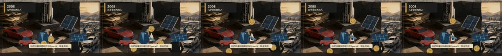

# 完整案例：马斯克成为首富的路径

这个案例用 24 秒演示 `collage-video-studio` 的定向多图层动画流程。它不是单张图的
推拉，也不靠所有图层持续抖动制造“动态感”。



下图是 PayPal 镜头的“预备—滑入—落位—回稳”连续五帧，而不是五张不同姿态的
交叉淡化：



下图是 2008 镜头的五个连续动作采样。人物由躯干、上臂、前臂三个刚性纸片组成，
肩和肘按父子支点联动，脚下根节点保持锁定：



- 成片：[final.mp4](final.mp4)
- 30 FPS 轻量预览：[result/preview.mp4](result/preview.mp4)
- GIF 预览：[result/preview.gif](result/preview.gif)
- 动作分相：[result/motion-strip.jpg](result/motion-strip.jpg)
- 关节分相：[result/rig-strip.jpg](result/rig-strip.jpg)
- 技术 QA：[qa/report.md](qa/report.md)
- 创意复核：[result/creative-review.md](result/creative-review.md)
- 机器可读构建摘要：[result/build-summary.json](result/build-summary.json)

## 成片讲什么

六个 4 秒镜头串起一条明确路径：

1. 首富不是工资结果，而是公司股权的市场价值；
2. 1999 年 Zip2 出售，马斯克获得约 2200 万美元；
3. 2002 年 PayPal 被收购，他获得约 1.76 亿美元；
4. 收益被重新投入 Tesla、SpaceX 等高风险项目，2008 年现金一度紧张；
5. Tesla 与 SpaceX 的经营规模和估值放大长期持有的股权；
6. Tesla 股价在 2020 年上涨超过 720%，马斯克在 2021 年首次成为世界首富。

片中金额均以“约”呈现。事实核对使用了 Tesla 的董事履历和人物介绍、eBay 向 SEC
提交的 PayPal 收购公告、NASA 的商业补给历史，以及 Forbes 对 2020—2021 年财富
变化的记录：

- [Tesla 2024 Proxy Statement](https://ir.tesla.com/_flysystem/s3/sec/000110465924048040/tm2326076d13_pre14a-gen.pdf)
- [Tesla — Elon Musk](https://www.tesla.com/en_ca/elon-musk)
- [eBay completes PayPal acquisition — SEC exhibit](https://www.sec.gov/Archives/edgar/data/1103415/000091205702037693/a2090698zex-99_1.htm)
- [NASA — first Commercial Resupply Services contracts](https://www.nasa.gov/history/10-years-ago-the-first-operational-cygnus-cargo-mission-to-the-space-station/)
- [Forbes — Musk first becomes the world’s richest person](https://www.forbes.com/sites/sergeiklebnikov/2021/01/08/elon-musk-is-now-the-richest-person-in-the-world-officially-surpassing-jeff-bezos/)

## 这次怎样解决“动态不像真实剪纸”

每个 `layers.json` 都有 `direction`：

```json
{
  "primary_action": "an articulated founder pushes one capital stack into three operating projects",
  "physical_cause": "sale proceeds are reinvested",
  "primary_layers": [
    "founder-torso",
    "founder-upper-arm",
    "founder-forearm",
    "capital-1",
    "capital-2",
    "capital-3"
  ],
  "motion_density": "medium",
  "phases": [
    {"name": "anticipation", "start_s": 0, "end_s": 0.55},
    {"name": "action", "start_s": 0.55, "end_s": 3.2},
    {"name": "settle", "start_s": 3.2, "end_s": 4}
  ]
}
```

动作遵守五条规则：

- 一镜一个主动作，不让每层同时循环；
- 先预备，再执行，最后过冲回稳；
- 人脸、桌面、地平线和落脚点保持稳定；
- 纸片只平移、旋转、落位，不拉伸变形；
- 人物关节使用 rig-space 支点层级，肩肘不延迟、不脱节，双轴锁定落脚根节点；
- 动作完成后允许有理由的阅读停顿，未登记停帧仍会被 QA 拒绝。

关键帧可给不同运动段设置不同 `ease`。例如信封先用 `back-in` 后撤蓄势，再用
`back-out` 滑入和落位，不再用一条缓动贯穿整个镜头。

## 六镜动作设计

| 镜头 | 景别 | 主动作 | 保持稳定的参照 |
|---|---|---|---|
| 股权钩子 | 人物近景 | 三根权益柱依次升起 | 人脸、山体、地面 |
| Zip2 | 车库中景 | 路线铺开，票据滑入 | CRT、桌面、书架 |
| PayPal | 桌面微距 | 信封滑入，硬币落位 | 笔记本、手、桌面 |
| 2008 | 俯拍决策桌 | 纸偶伸臂推动资本拆分到三个项目 | 人物脚点、汽车、火箭台、太阳能板 |
| 规模 | 工业全景 | 汽车、火箭、权益柱依次响应 | 工厂、远山、人物 |
| 2021 | 财富远景 | 阶梯组装，排名圆片盖下 | 肖像、火箭、汽车 |

相邻镜头使用不同背景取景、不同主体比例和不同运动方向。角色没有循环换姿势，也
没有跨屏滑行。

## 声音

旁白由 `voice_director.py` 使用 `zh-CN-YunxiNeural` 生成，方向是冷静的商业纪录片
男声。六段音频分别校验，不允许超过镜头时长；随后统一为 48 kHz 单声道、-18 LUFS。
底乐由 `create_audio_assets.py` 本地合成，只有低频脉冲、纸张敲击和轻合成器，旁白
出现时由最终混音自动压低。

## 一条命令重建

前置条件：Python 3.10+、Pillow、FFmpeg、FFprobe。仓库已经包含最终旁白、生成的
原创纸艺参考板和全部透明图层，因此重建不需要 API Key，也不需要再次联网。

```bash
python examples/musk-wealth-demo/build_demo.py
```

构建会依次完成：

```text
story → styles → images → layers → motion → voice → music → render → QA
```

最终应得到：

- 24 秒、1920×1080、30 FPS、H.264/AAC；
- 6 个图层包、57 个透明图层、33 个独立活动层；
- 5 个父子跟随层，其中 2 个是肩—肘 rig-space 关节；
- 第四镜的纸偶脚点双轴锁定；第五镜的两个车轮和火箭尾焰由主物体驱动；
- 全部从属层通过逐帧运动审计与接触锁；
- 6 个定向主动作；
- QA 0 错误、0 警告；
- story、style、creative-qa 三个审批门全部有效。

## 如何改成自己的主题

1. 复制 `project.seed.json`，重写 beat、narration、scene、element_motion 和 direction；
2. 为每镜先写 `primary_action` 和 `physical_cause`；
3. 把主物体拆成透明 PNG，其他参照层保持稳定；
4. 在 `layers.json` 里登记 primary layers 和三段时间；
5. 先渲染一镜，看清动作范围、接触和回稳，再批量渲染；
6. 用最终 MP4 验收，GIF 和接触表只作辅助。

更完整的导演协议见
[references/directed-motion.md](../../references/directed-motion.md) 和
[references/motion-audit.md](../../references/motion-audit.md)。人物关节协议见
[references/articulated-rigs.md](../../references/articulated-rigs.md)。

## 素材说明

三张无文字纸艺参考板由内置图像生成模式制作，最终年份、金额、中文标题和字幕全部
由本地 Pillow/FFmpeg 渲染。透明主物体、动作关键帧、音乐、清单和 QA 均可在仓库内
重建。生成提示词要求工业纸艺纪录片风格、真实接触和重力、无水印、无生成文字。
